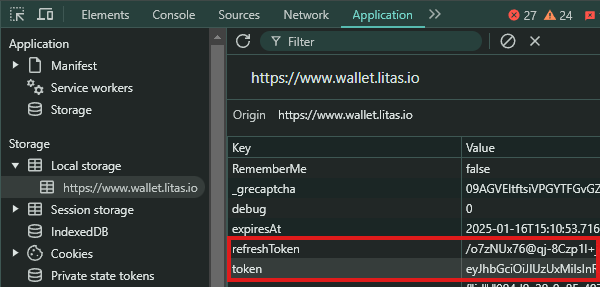

# Litas 自动领取和启动挖矿


## 功能

- **自动启动/领取挖矿**
- **支持多账户**
- **支持代理使用**

## 前提条件

- 已安装Node.js
- `tokens.txt` 文件包含token和refresh token，按以下步骤获取：
- 打开litas仪表盘 [https://www.wallet.litas.io](https://www.wallet.litas.io/invite/zlkcyber)
- 使用邮箱登录
- 按F12打开开发者工具，找到Application选项卡
- 在Local Storage中找到`token`和`refreshToken`并复制这两个值
    

## 安装

1. 克隆仓库：
    ```sh
    git clone https://github.com/0xbaiwan/Litas_Bot.git
    cd Litas_Bot
    ```

2. 安装依赖：
    ```sh
    npm install
    ```
3. 在`tokens.txt`文件中输入你的token，每行一个用户，格式为`token|refreshToken`
    ```sh
    nano tokens.txt
    ```
4. 可选：使用代理：
- 在`proxy.txt`中粘贴代理，格式为`http://用户名:密码@IP:端口`
    ```sh
    nano proxy.txt
    ```
5. 运行脚本：
    ```sh
    npm run start
    ```

## 

本项目采用 [MIT 许可证](LICENSE)。
